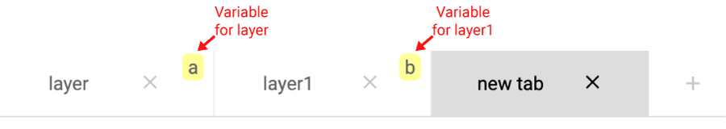
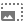

# MITRE ATT&CK® Navigator

The ATT&CK Navigator is designed to provide basic navigation and annotation of ATT&CK matrices, something that people
are already doing today in tools like Excel. We've designed it to be simple and generic - you can use the Navigator to
visualize your defensive coverage, your red/blue team planning, the frequency of detected techniques or anything else
you want to do. The Navigator doesn't care - it just allows you to manipulate the cells in the matrix (color coding,
adding a comment, assigning a numerical value, etc.). We thought having a simple tool that everyone could use to
visualize the matrix would help make it easy to use ATT&CK.

The principal feature of the Navigator is the ability for users to define layers - custom views of the ATT&CK knowledge
base - e.g. showing just those techniques for a particular platform or highlighting techniques a specific adversary has
been known to use. Layers can be created interactively within the Navigator or generated programmatically and then
visualized via the Navigator.

Bug reports and feature requests can be submitted to
our <a href="https://github.com/mitre-attack/attack-navigator/issues">GitHub Issue Tracker</a>. The source code for the
ATT&CK Navigator can be retrieved from our <a href="https://github.com/mitre-attack/attack-navigator">GitHub
repository</a>.

<!-- sections -->

# Layers

A layer constitutes a view of the tactics and techniques matrix for a specific technology domain. In more recent
versions, the Navigator can manipulate either the Enterprise, Mobile, or ICS ATT&CK technology domain knowledge bases.
Within a technology domain, the Navigator allows you to filter your view of the matrix in a variety of ways, displaying
the tactics and techniques that are important to you.

You can view the definition of any technique in the visible matrix by right-clicking on the technique and selecting
"view technique" in the pop-up menu. A new browser tab will be opened displaying the definition of the technique. In this
way the Navigator allows you to explore a given ATT&CK matrix and access the definitions of the techniques.

Beyond the filters, layers also provide a means to customize your view of the matrix. To that end, you can
<a href="#assigning-manual-colors">color</a>,
<a href="#hiding-disabled-techniques">hide</a>,
<a href="#adding-comments-to-techniques">comment</a>, and assign
<a href="#scoring-techniques">numeric scores</a>,
<a href="#assigning-links-to-techniques">links</a>, and
<a href="#adding-metadata-to-techniques">metadata</a>
to techniques to aid in analysis of threats and your defenses against those threats. As stated earlier, the Navigator is
designed to be simple, allowing you to assign whatever meaning you want to the color-codings, scores, and comments. This
way the Navigator can support whatever you want to do without requiring changes to the Navigator code itself.

Each layer created is independent of other layers. However, layers can be
<a href="#creating-layers-from-other-layers">combined</a> in ways to support analysis, or
<a href="#saving-and-loading-layers">saved locally</a>. Layer files are saved in easy to parse and easy to generate JSON
file so that ATT&CK data can be used in other applications, analyzed beyond the capability of the ATT&CK Navigator, and
generated by tools for import into the Navigator. The Layer file format is
described <a href="layers/">here</a>.

## Creating New Layers

To create a new layer, open a new tab and click the "Create New Layer" dropdown. The quick access buttons will create a
layer with the current version of ATT&CK. Past versions of ATT&CK compatible with the Navigator are accessible in the
"More Options" dropdown. This interface allows you to specify the desired version and domain for the new layer. Note
that for performance reasons, the Navigator currently imposes a limit of ten (10) active layers at any given point in
time.

## Saving and Loading Layers

Layers can be saved by clicking the "save layer"
button (). This will open a dialog to save a layer
configuration file to your local computer. This contains the configuration for the techniques that have been customized
(commented, colored, disabled, or assigned a score, links, or metadata) as well as the scoring gradient setup, filter selection,
layer name, layer description, view configuration.

Saved layer configuration files can be opened in the ATT&CK Navigator to restore a layer you've worked on previously. To
do so, open a new tab and open the "Open Existing Layer" panel. Then click "Upload from local", and select your saved
configuration file. Doing so will restore your saved layer to the ATT&CK Navigator. This interface also has a "load from
URL" input allowing you to open a layer json from a remote source.

## Upgrading a Layer to the Current Version

The layer upgrade interface allows users to upgrade an ATT&CK Navigator layer created on a previous version of ATT&CK to the
current version of the dataset. With this interface, users can step through each change in the dataset of techniques:

- The user can view techniques which have been added to the dataset since the layer was created and annotate them as necessary.
- The user can see whether the techniques they had previously annotated have changed and adjust the annotations accordingly.
- The user can determine if any annotated techniques have been removed or replaced by new techniques and in the latter case copy
annotations to the replacing technique(s).
- The user can also verify what techniques haven't changed since the layer was created.

### Mapping Annotations

For annotated techniques which have changed since the layer was created, you may want to update the set of annotations to account
for changes to scope or content. Each technique in the interface lists its previous and current state, with links to
<a href="https://attack.mitre.org/">the ATT&CK Website</a> for both versions of the technique to enable easy review. In steps with techniques you
have previously annotated, you can enable the "show annotated techniques only" filter to view only those techniques which have annotations.

You can copy annotations from the previous version of the technique to the current one, making adjustments if necessary. There are
two approaches to copying annotations from the previous version:

- For techniques with tactics that map one-to-one between the two versions, annotations can be copied by clicking the ">"
button next to the tactic. This will copy any existing annotations on the tactic to the technique under the same tactic in
the current version.
- For techniques with tactics that have changed between the two versions, annotations can be copied by dragging & dropping the
annotated tactic from the previous version to the tactic(s) in the current version.

Techniques can be marked as reviewed under their respective panels to visually indicate that they have been reviewed. The "reviewed
X/Y techniques" displayed underneath the techniques list can be used to determine if you missed any techniques. The numerator reflects
the number of techniques you have marked as "reviewed" and the denominator denotes the total number of techniques shown according
to your configuration (for example, if you have enabled the "show annotated techniques only" filter, only the number of techniques
which are annotated are counted in this total).

You can view and verify the status of the layer upgrade at the end of the workflow to ensure you have created or adjusted all annotations
as desired. A status is displayed next to each section name to indicate either the number of techniques you have reviewed in the section,
if you have skipped the section, or if there are no techniques to review in the section. Once you have finished upgrading the layer, you
can click the "done" button to close the sidebar.

<b>Note:</b> You will not be able to return to the layer upgrade interface after the sidebar is closed.

## Creating Layers from Other Layers

Layers can be created which inherit properties from other layers. Several fields exist which can be used to choose which
layers to inherit properties from:

- <b>Domain:</b> choose the domain and version for the new layer. Layers can only inherit properties from other layers
  of the same domain and version.

- <b>Score Expression:</b> Technique <a href="#scoring-techniques">scores</a> in the created layer are initialized to
  the result of this expression. This field should take the form of an equation or constant, using variables for
  layers.Layer variables are shown in yellow on tabs when the "create layer from other layers" panel is opened:  
  

  Each technique's score is created independently using the score expression. For example, with a score expression
  of <code>a+b</code>, some technique <i>t</i> in the output layer would be the sum of <i>ta</i> and <i>
  t b</i>.

  Expressions can also be comparative, for example <code>a>b</code> will create a layer with a score of 1
  whereever <code><a>b</code> and 0 whereever <code>a<=b</code>. Such boolean expressions can be extended using <code>
  and</code>, <code>or</code>, <code>xor</code> and <code>not</code>. You can also use ternary expressions such
  as <code>a > b ? 25 : 10</code>. See <a href="http://mathjs.org/docs/expressions/syntax.html#operators">this page</a>
  for a full list of operators.

  Some example score expressions:
  - <code>(a+b)/2</code> (average two layers)
  - <code>a+b+c</code>
  - <code>a*(b+c)</code>
  - <code>100-a</code> (reverse the scoring of <code>a</code>, assuming <code>a</code> is on a 0-100 scale)
  - <code>(a>b) and (a>=75)</code>

- <b>Gradient:</b> choose which layer to inherit <a href="#scoring-gradient">scoring gradient</a> from.
- <b>Coloring:</b> choose which layer to inherit <a href="#assigning-manual-colors">manually assigned technique
  colors</a>.
- <b>Comments:</b> choose which layer to inherit <a href="#adding-comments-to-techniques">
  technique comments</a> from.
- <b>Links:</b> choose which layer to inherit <a href="#assigning-links-to-techniques">assigned links</a> from.
- <b>Metadata:</b> choose which layer to inherit <a href="#adding-metadata-to-techniques"> technique metadata</a> from.
- <b>States:</b> choose which layer to inherit technique <a href="#disabling-techniques">
  enabled/disabled states</a> from.
- <b>Filters:</b> choose which layer to inherit <a href="#filtering">layer filter configuration</a> from.
- <b>Legend:</b> choose which layer to inherit <a href="#legend-bar">legend items</a> from.

Tactic-spanning Techniques are evaluated individually: if a technique is annotated differently in two tactics, the
output layers' techniques will honor this difference.

<b>Tip:</b> Score expressions don't need to use variables! You can use this to create a new layer with a constant score
for each technique. For example, if you wanted a new layer where all techniques are scored 50, you could simply type 50
into the score expression input.

# Layer Controls

## Layer Information

The layer name and description can be edited in the layer information dropdown. The layer name can also be edited where
it appears in the tab title. Additionally, the layer information panel allows the user to add metadata and assign links
to the layer. Metadata can be useful for supporting other applications that use the layer format, or for attaching additional
descriptive fields to the layer. Links can be useful for providing additional context from other websites that are relevant
to the layer.

## Sorting

There are four modes of sorting. Clicking the sorting button will toggle between the modes.

- The table will sort techniques
  alphabetically by name in ascending order.
- The table will sort techniques
  alphabetically by name in descending order.
- The table will sort techniques by
  their score in ascending order. Techniques with no score are treated as if their score is 0.
- The table will sort techniques by
  their score in descending order. Techniques with no score are treated as if their score is 0.

## Filtering

The list of techniques and tactics can be filtered in the filtering menu. Filters are additive - the displayed set of
techniques is the logical <i>or</i> of the techniques of the filters selected.

### Platform Filter

The platform filter allows the user to control which techniques are included in a layer based on whether a particular
technique applies to a particular technology platform. Technology platforms are tied to the specific technology domain
you are visualizing. For the Enterprise technology domain, the defined platforms are:PRE, Windows, Linux, macOS,
Network, AWS, GCP, Azure, Azure AD, Office 365, and SaaS. For the Mobile technology domain, the defined platforms are:
Android and iOS. For the ICS technology domain, the defined platforms are Windows, Control Server, Data Historian, "
Engineering Workstation", Field Controller/RTU/PLC/IED, Human-Machine Interface, Input/Output Server, Safety
Instrumented System/Protection Relay.

Each technique in an ATT&CK matrix is tied to one or more platforms. In the Navigator, if you wanted to see only those
techniques in Enterprise ATT&CK which applied to the Linux platform, you would deselect "Windows" and "macOS" under the
platform filter. If later you decided to also include techniques known to apply to macOS platforms, you could select "
macOS" as well and those techniques would be added to the visible layer.

<b>Tip:</b> Techniques can also be hidden from your view by using the <a href="#hiding-disabled-techniques">hide
disabled techniques</a> button. Couple this with the <a href="#search-amp-multiselect-interface">multiselect
interface</a> to hide techniques which are contained in specific threat or software groupings.

## Color Setup

### Tactic Row Background

The background color of the tactic row can be set in the tactic row background section of the color setup menu. The
color will only be displayed if the "show" checkbox is selected. The tactic row background will not be shown when in the
<a href="#mini-layout">mini view</a>.

### Scoring Gradient

Techniques which are assigned a score will be colored according to a gradient defined in the scoring gradient section in
the color setup menu. Technique scores are mapped to a color scaled linearly between the "low value" and "high value"
inputs. For example, on a red-green scale, if "low value" were set to 0 and
"high value" were set to 50, a score of 25 would fall on yellow -- exactly halfway between red and green. Scores below
the low value are colored as if they have the low value, and scores above the high value are colored as if they have the
high value.

Several preset gradients are present within the preset dropdown. If no preset matches your desired gradient, you can
create your own by adding and removing colors using the interface.

<b>Tip:</b> If your scores are binary (0 or 1), consider setting the low value of 0 to transparent and the high of 1 to some
other color to only color the techniques which have the value of 1.

## Hiding Disabled Techniques

Techniques that are <a href="#disabling-techniques">disabled</a> can be hidden by toggling the "hide disabled
techniques" button. Hidden techniques are still present in the data when saved and can still be annotated, but won't be
visible in the view.

<b>Tip:</b> This button has powerful synergy with the
<a href="#search-amp-multiselect-interface">multiselect interface</a>. Use the multiselect interface to select
techniques which match your criteria,disable them, and then turn on hiding disabled techniques to remove entire groups
of techniques from your view.

## Showing or Hiding Sub-techniques

Sub-techniques in the view are nested under their parent technique and are hidden by default.

- All sub-techniques can be shown by
  clicking the "
  expand sub-techniques" button.
- All annotated
  sub-techniques can be shown by clicking the "expand annotated sub-techniques" button.
- All sub-techniques can be hidden by
  clicking the "collapse sub-techniques" button.

  <b>Tip:</b> Sub-techniques can also be shown or hidden on each individual technique when in
  the <a href="#side-layout">side layout</a> or
  <a href="#flat-layout">flat layout</a> by clicking the gray sidebar on the technique cell.

## Configuring the Layout

The ATT&CK Navigator has controls for how the ATT&CK Matrices are displayed. Access controls to change layout via the "
Matrix Configuration" dropdown menu.

### Side Layout

The side layout displays sub-techniques adjacent to their parent techniques. Techniques with sub-techniques are denoted
by the presence of a right-positioned sidebar which can be clicked to show sub-techniques. Sub-techniques are
differentiated from techniques by position in the tactic column.

### Flat Layout

The flat layout displays subtechniques in-line with the techniques. Techniques with subtechniques are denoted by the
presence of a left-positioned sidebar which can be clicked to show subtechniques. Subtechniques are differentiated from
techniques by indentation.

### Mini Layout

The mini layout is designed to fit more techniques on the screen simultaneously by reducing their size. To do so all
text is removed and techniques are visualized as squares under the tactic. Selecting this layout disables
<a href="#showing-ids-and-names">the "show IDs" and "show Names" controls</a>. Tactic headers are visualized as black
cells above the columns. Technique and tactic names are displayed as tooltips when you hover over a technique or
tactic-header cell. Techniques and their sub-techniques are grouped inside of an outlined box. The technique is the
dark-outlined first cell of the group, and the rest of the cells of the group are the sub-techniques. Techniques without
sub-techniques are displayed without a grouping box, and may appear inline with other sub-techniques-less
techniques. Disabled techniques are denoted with an "x" symbol. Techniques with comments are denoted with an "i" symbol.

### Showing IDs and Names

In the side and flat layouts, you can change what is shown inside of the technique cells. Enabling "show names" (enabled
by default) will show technique and tactic names on each cell of the matrix. Enabling "show IDs" (disabled by default)
will show ATT&CK IDs (e.g "T1000" for techniques, or "TA1000" for tactics) on each cell of the matrix. These controls can
be toggled independently and turned off entirely to remove cell labels entirely. The mini layout forces both of these
controls to be disabled.

## Aggregate Scores

Aggregate scores will combine the scores of a technique and all of its sub-techniques, and can be calculated using
either the average, max, min or sum function. They will display only on techniques with sub-techniques. The display of
aggregate scores in the matrix view and the score calculations can be customized via the "Matrix Configuration" dropdown
menu.

### Showing or Hiding Aggregate Scores

Aggregate scores in the view are displayed in the tooltip when hovering over a technique, and are hidden by default.
When this is enabled, the technique's background color will be calculated using the aggregate score by default.

### Counting Unscored Techniques

By default, techniques which are unscored are not included in aggregate score computations. Enabling
"count unscored techniques as 0" will make unscored techniques count as if their scores were 0 when computing an
aggregate score.

### Choosing an Aggregate Function

There are 4 available functions to calculate the aggregate score: average, min, max, and sum.

- Average:
  - if including unscored techniques, will add up the scores of a technique and all of its sub-techniques, and divide
      by all; if not including unscored techniques, will add up the onlythe nonzero scores of a technique and its
      sub-techniques, and divide by the count of non-zeroscores.

- Min:
  - will take the minimum of the scores of a technique and all of its sub-techniques.

- Max:
  - will take the maximum of the scores of a technique and all of its sub-techniques.

- Sum:
  - will add the scores of a technique and all of its sub-techniques.

## Legend Bar

The legend helps associate meanings with colors displayed by customized techniques in the ATT&CK Navigator. To open the
legend, click on the bar labeled "legend" in the bottom-right corner of the screen. Click on the same bar to close the
legend. To add an item to the legend, click the "Add Item"button. To clear all items in the legend, click "Clear".  

An item's color can be changed by either clicking in the color field and typing a hex color value, or by
clicking in the field and choosing a color from the color picker. Click and type in the text field to change the item's
label. To remove an item, click on the () button on the
right side. Legend items are saved to the layer file and will be loaded when a layer with saved legend items is loaded.

# Technique Controls

Techniques in the layer can be annotated. The technique controls on the menubar are only enabled when one or more
techniques are <a href="#selecting-techniques">selected</a>. If multiple techniques are selected, they will all be
annotated simultaneously.

## Disabling Techniques

Clicking the "toggle state" button toggles selected techniques between an enabled and disabled state. In the disabled
state, the technique text is greyed out and no colors (<a href="#assigning-manual-colors">assigned manually</a> or via
<a href="#scoring-techniques">score</a>) will be displayed.

The <a href="#hiding-disabled-techniques">hide disabled techniques</a> button can be used to hide disabled techniques
from the view.

## Assigning Manual Colors

Techniques can be assigned colors manually. Manually assigned colors supersede colors created by score. To remove a
manually assigned color, select the "no color"box at the top of the interface.

## Scoring Techniques

A score is a numeric value assigned to a technique. The meaning or interpretation of scores is completely up to the user
user - the Navigator simply visualizes the matrix based on any scores you have assigned. Some possible uses of scores
include:

- Assigning a score to techniques based on whether a given adversary group has been observed to use that technique.
- Assigning a score to techniques based on your organization's ability to detect, prevent and/or mitigate the use of a
  particular technique.
- Assigning a score to those techniques that a red-team has successfully employed during an exercise.

By default, techniques are "unscored" meaning that no score has been assigned to the technique. Note that "unscored" and
a score of zero are not the same, specifically with respect to automatically assigned colors. Scores show up in
technique tooltips if a score has been assigned. To change a technique with a numeric score to unscored, select the
technique and delete the score value in the score control. The technique will revert to unscored.

Techniques are automatically assigned a color according to its score. This color is determined according to
the <a href="#scoring-gradient">scoring gradient setup interface</a>. Colors
assigned <a href="#assigning-manual-colors">manually</a> supersede the score-generated color. It is a good idea to
assign techniques scores inside of a predetermined range, such as 0-1 or 0-100. Set the "high value" and "low value"
inputs in the <a href="#scoring-gradient">scoring gradient setup interface</a> to this range to make sure that the color
for the score is properly mapped to the gradient. Techniques that are unscored are not assigned a color based on the
gradient - they are displayed with an uncolored background in the matrix.

## Adding Comments to Techniques

A text comment can be added to techniques. This comment will show up in the technique tooltip if a comment has been
added. Techniques with a comment will be given a yellow underline.

<b>Note:</b> A yellow underline is also shown if <a href="#adding-metadata-to-techniques">metadata</a> has been added to the
technique or if the technique has attached <a href="https://docs.oasis-open.org/cti/stix/v2.1/cs01/stix-v2.1-cs01.html#_gudodcg1sbb9">Notes</a>
in the source data. Notes cannot be edited in the Navigator and are displayed in the tooltip.

## Assigning Links to Techniques

Links can be assigned to techniques by specifying a label and a URL for each link. URLs must be prefixed with a protocol identifier
(e.g. 'https://'). Multiple links can be added by clicking "add links"
in the interface. These are displayed in the context menu (accessed by right clicking on a technique) and will open a new
browser tab when clicked. To visually separate the links in the context menu, a divider can be added in the interface which will display a
horizontal line in the context menu where the divider occurs in the list of assigned links.
Techniques with assigned links will be given a blue underline.

<b>Note</b>: Links can only be added, updated, or removed if the list of links of all the currently selected techniques
are identical, including dividers.

## Adding Metadata to Techniques

Technique metadata can be added by specifying metadata names and values and are displayed in the technique tooltip. Metadata is useful
for adding supplemental descriptive fields and information to techniques. To visually separate metadata fields, a divider can be added
in the interface, which will display a horizontal line in the tooltip where the divider occurs in the list of metadata.
Techniques with metadata will be given a yellow underline.

<b>Note</b>: Metadata can only be added, updated, or removed if the list of metadata of all the currently selected techniques
are identical, including dividers.

## Clearing Annotations on Techniques

Clicking the "clear annotations on selected" button removes comments, links, metadata, colors, scores, and enabled/disabled state from
all selected techniques.

# Selecting Techniques

In order to be annotated, techniques must first be selected. There are multiple ways to select techniques.

## Selecting with the Mouse

Techniques can be selected using the mouse. Left click a technique to select it. Pressing control (windows) command (
mac) or shift (both) while left-clicking a technique will add it to or remove it from the selection. Right clicking a
technique will bring up a context menu with more options:

- <b>select:</b> Select only this technique.
- <b>add to selection:</b> Add this technique to the selection.
- <b>remove from selection:</b> Remove this technique from the selection.
- <b>invert selection:</b> Select all techniques that are not currently selected and unselect all techniques that are
  currently selected.
- <b>select all:</b> Select all techniques.
- <b>deselect all:</b> Deselect all techniques. This action can also be completed by the "
  deselect" () button.
- <b>select annotated:</b> Select all techniques and sub-techniques which have annotations or remove unnanotated
  techniques from an existing selection.
- <b>select unannotated:</b> Select all techniques and sub-techniques which do not have annotations or remove annotated
  techniques from an existing selection.
- <b>select all techniques in tactic:</b> Select all techniques in this tactic. This action can also be completed by
  clicking on the tactic header and follows the behavior preference under selection
  behavior in the selection controls.If the “select techniques across tactics” control is enabled, the selection
  will include instances of techniques that are in other tactics. Disable this control to select only the instances of
  techniques that are within this tactic. Sub-techniques within the tactic can be selected along with their parent
  technique by enabling the “select sub-techniques with parent” control.
- <b>deselect all techniques in tactic:</b> Deselect all techniques in this tactic. This action follows the behavior
  preference under selection behavior in the selection controls.If the “select
  techniques across tactics” control is enabled, instances of techniques across all tactics will be deselected. Disable
  this control to remove only the instances of techniques within this tactic from the selection. Sub-techniques in this
  tactic will be deselected with their parent technique if the “select sub-techniques with parent” control is enabled.
  Note that currently selected sub-techniques will remain selected if the control is disabled when using this option.
- <b>view technique:</b> For more information / details on the technique.
- <b>view tactic:</b> For more information / details on the tactic.
- <b>user assigned links:</b> List of links assigned to the technique by the user. These links will open a new browser tab directed to the
specified URL. See <a href="#assigning-links-to-techniques">Assigning Links to Techniques</a> for more details.

<b>Tip:</b> You can use "select unannotated" followed by disabling those techniques, and then hiding disabled
techniques,to create a layer where only annotated techniques are visible.

## Selection Behavior

The selection behavior controls affect how sub-techniques are selected with regards to tactics and sub-techniques.

- <b>Select techniques across tactics</b> toggles whether selecting a technique that is found in multiple tactics
  selects it in all tactics, or just the one wherein it was clicked.
- <b>Select sub-techniques with parent</b> toggles whether sub-techniques are selected alongside their parents, and vice
  versa. When enabled, clicking on a technique will also select all of the sub-techniques of that technique. In
  addition,clicking a sub-technique will also select the parent as well as all sibling sub-techniques. When disabled,
  sub-techniques are selected independently of parents and siblings.

## Search & Multiselect Interface

The search & multiselect interface provides the means to select or deselect techniques in the matrix that match a text
query or that are mapped to groups, software, or mitigations. The text input can be used to filter the lists of
techniques, groups, software, and mitigations according to their data. You can select what fields of the objects are
searched under "search settings:" <i>name</i>, <i>ATT&CK ID</i>, <i>description</i>, and (for techniques) <i>data
sources</i> can all be searched.

The lists of objects below the search can be used to select data in the matrix.

- <b>Techniques:</b> this list can be used to find a technique alphabetically or one that matches the search query.
- <b>Threat Groups:</b> threat groups constitute related intrusion activity tracked under a common name. Selecting a
  group under this section will select all techniques that are mapped to (used by) that group.
- <b>Software:</b> software constitutes malware (custom closed source or open source software intended for malicious
  purposes)or tools (open-source, built-in, or publicly available software that could be used by a defender or an
  adversary). Selecting a software under this section will select all techniques that are mapped to (used by) that
  software.
- <b>Mitigations:</b> Mitigations represent security concepts and classes of technologies that can be used to prevent a
  technique or sub-technique from being successfully executed. Selecting a mitigation under this section will select all
  techniques that are mapped to (mitigated by) that mitigation.

The interface provides buttons to select and deselect each object. These buttons modify the currently selected
techniques rather than replacing then, allowing for the selection of the multiple techniques or the techniques of
multiple threat groups, software, or mitigations by selecting them in sequence. The 'view' links for each entry link to
additional information about the object in question.

Buttons labelled 'select all' and 'deselect all' are provided to quickly select/deselect all techniques in the results
area. You can use this in conjunction with the search input to select all results which match the given query.

# Customizing the Navigator

The ATT&CK Navigator can be customized by modifying the fragment (e.g <code>example.com<b>#fragment</b></code>) of the
URL. A panel on the new tab page exists to build a properly formatted ATT&CK Navigator URL such that, when opened, it
will create an ATT&CK Navigator instance with the desired customizations. This feature may be useful for sharing or
embedding the ATT&CK Navigator.

## Default Layers

Click the "add a layer link" button, then enter a default layer URL pointing to a layer hosted on the web. This will
cause the customized ATT&CK Navigator to initialize with this layer open by default. This is especially useful for
embedding or sharing specific layers.

You can click the "add another layer link" button to specify additional default layers, or click the "x" button next to
a layer link you've already added to remove it.

The following is an example ATT&CK Navigator URL with the default layer specified to be the *Bear APTs layer
from <a href="https://github.com/mitre-attack/attack-navigator">our github
repo</a>:  
<code><https://mitre-attack.github.io/attack-navigator/enterprise/><b>#layerURL=https%3A%2F%2Fraw.githubusercontent.com%2Fmitre%2Fattack-navigator%2Fmaster%2Flayers%2Fdata%2Fsamples%2FBear_APT.json</b></code>

Users will not be prompted to upgrade default layers to the current version of ATT&CK if they are outdated.

## Disabling Features

Individual ATT&CK Navigator features can be disabled with the checkboxes. Removing a feature only removes the interface
elements of the feature -- opened layers utilizing those features will still have them present. For example, even if
comments are disabled layers with comments present will still display them visually and in tooltips.

If you are hosting your own navigator instance, you can also disable features by editing the configuration file <code>
assets/config.json</code>.

The following is an example ATT&CK Navigator URL with the ability to download the layer and add comments
disabled:  
<code><https://mitre-attack.github.io/attack-navigator/enterprise/><b>#download_layer=false&comments=false</b></code>

# Rendering Layers as SVG

Clicking the "render layer to SVG" button will open a pop-up window allowing the current layer to be rendered to an SVG
image. Clicking the <i>download svg</i> button ()
will download the image, as displayed, in SVG format.

<b>Note:</b> this feature has minor compatibility warnings with the Internet Explorer browser. For best results, please
use Firefox, Chrome or Edge.

The Microsoft Edge browser has a bug where the downloaded SVG will have the <code>.txt</code> extension. Renaming the
extension to <code>.svg</code> will restore it as a valid svg file.

## Measurement Units

Clicking the "toggle measurement unit" button will toggle between measuring in inches (in), centimeters (cm), and
pixels (px). This unit applies to controls for image size and legend position.

## Configuring Image Size

The image size controls allow you to specify the width and height of the image, as well as the height of the header if
one is present. The measurements are in units specified by the <a href="#measurement-units">
measurement units</a> control.

The header height contributes to the total image height: if you have specified the image height to be 8.5 inches and the
header height to be 1 inch, the technique table will be 7.5 inches and the header 1 inch for a total height of 8.5
inches. If the header is disabled this control will not be editable.

## Configuring Text

The text configuration dropdown allows for the configuration of the font
(serif, sans-serif, and monospace) of the exported render.

Unlike in previous versions of the Navigator, in more recent versions of the ATT&CK Navigator text size is automatically
calculated to optimize readability.

## Customizing the Legend

This menu can only be opened if a <a href="#legend-bar">legend</a> is present on the layer or if techniques have been
assigned scores. The checkbox allows you to undock the legend from the SVG header. Once undocked, the X and Y position
controls can be used to position the legend in the image. The width and height inputs control the size of the legend
when it is undocked. The measurements are in units specified by the <a href="#measurement-units">measurement units</a>
control.

## Display Settings

The header itself, or specific parts of the header, can be hidden using the controls in this dropdown. The color of
table cell borders can also be edited.

- <b>Show header</b> controls whether the header is shown at all. If the legend is undocked from the header it will
  still be shown.
- <b>Show about</b> controls whether the about (layer name and description) section of the header is visible. If the
  layer has no name nor description, the control will be disabled and the section automatically hidden.
- <b>Show domain</b> controls whether the domain (layer domain and version) section is visible in the header. This
  control will be disabled if the header is hidden in entirety.
- <b>Show filters</b> controls whether the current filters (selected platforms) are visible in the header. This control
  will be disabled if the header is hidden in entirety.
- <b>Show legend</b> controls whether the layer legend is visible. If the layer has no defined legend items or no
  scores, the control will be disabled and the legend will be automatically hidden.
- The <b>sub-techniques</b> dropdown controls the visibility of sub-techniques in the rendered layer. Selecting "show
  all" will show all sub-techniques, "show expanded" will show sub-techniques whose parent techniques were expanded when
  the render button was clicked, and "show none" will show no sub-techniques.
- <b>Cell border</b> controls the border of cells in the body of the table. The borders in the header are not modified
  by this control. Note that you must click "apply" in the color picker for your change to take effect.

# Exporting Layers to MS Excel

Layers can be exported to MS excel (.xlsx) format. Clicking on the "export to excel" button in the toolbar will download
an .xlsx file which contains the current layer. This layer contains the annotations from the view -- color (via score or
manually assigned) and disabled states. The exporter also honors tactic header background, sorting, filtering and hidden
techniques.

# Notice

Copyright 2020 The MITRE Corporation

Approved for Public Release; Distribution Unlimited. Case Number 18-0128.

Licensed under the Apache License, Version 2.0 (the "License"); you may not use this file except in compliance with the
License. You may obtain a copy of the License at

<http://www.apache.org/licenses/LICENSE-2.0>

Unless required by applicable law or agreed to in writing, software distributed under the License is distributed on an "
AS IS" BASIS, WITHOUT WARRANTIES OR CONDITIONS OF ANY KIND, either express or implied. See the License for the specific
language governing permissions and limitations under the License.

This project makes use of ATT&CK&reg;

<a href="https://attack.mitre.org/resources/terms-of-use/">ATT&CK&reg; Terms of Use</a>
